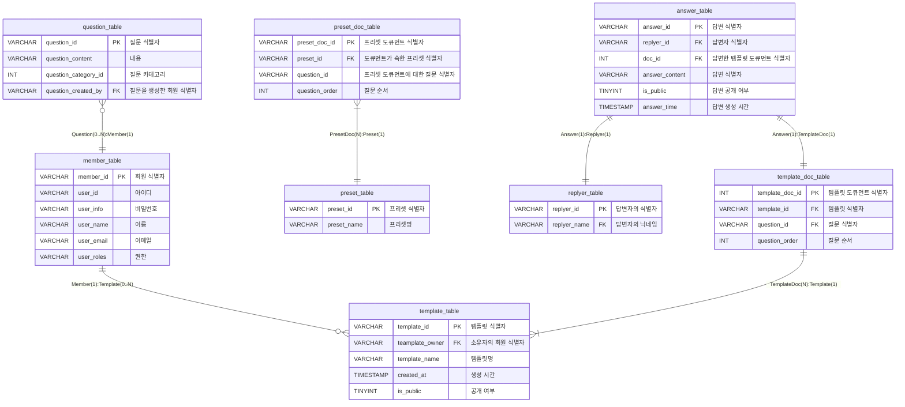

  
# Ten Quest: 익명 질문 소통 플랫폼
추천 질문지 또는 나만의 질문지를 생성하여 공유하고, 해당 링크를 통해 다른 사용자들이 익명으로 질문에 대한 답변을 남겨주는 서비스이다.

<br/>

## Demo

### 질문자 입장에서의 서비스 이용
<table>
  <tr>
    <th align="center" width='350px'>
      나만의 질문지 생성하기
    </th>
    <th align="center" width='350px'>
      추천 템플릿으로 질문지 생성하기
    </th>
  </tr>
  <tr>
    <td align="center" width='350px'>
      
    </td>
    <td align="center" width='350px'>
      
    </td>
  </tr>
  <tr>
    <td align="center" width='350px'>
      사용자는 여러 카테고리의 예시 질문 중 선택하거나, 직접 질문을 작성해서 최대 10개의 질문을 담은 나만의 질문지를 생성하여 공유할 수 있다.
    </td>
    <td align="center" width='350px'>
      사용자는 아이스브레이킹과 같이 특정한 상황에 맞추어 추천 질문을 미리 담아놓은 템플릿을 통해 간편하게 질문지를 생성하여 공유할 수 있다.
    </td>
  </tr>
</table>

### 답변자 입장에서의 서비스 이용
<table>
  <tr>
    <th align="center" width='350px'>
      질문지에 익명으로 답변하기
    </th>
    <th align="center" width='350px'>
      다른 사용자의 답변 확인하기
    </th>
  </tr>
  <tr>
    <td align="center" width='350px'>
      
    </td>
    <td align="center" width='350px'>
      
    </td>
  </tr>
  <tr>
    <td align="center" width='350px'>
      질문지 링크에 접속한 사용자는 익명으로 질문지에 답변을 남길 수 있다.
    </td>
    <td align="center" width='350px'>
      질문지에 답변을 남긴 후 사용자는 다른 사용자들이 남긴 답변들을 구경할 수 있다.
    </td>
  </tr>
</table>


<br/>

## System Architecture


<br />

## ERD




<br/>

## Backend API


<br/>

## Tech Stack
<table>
  <tbody>
    <tr>
      <th align="center">Frontend</th>
      <th align="center">Backend</th>
      <th align="center">DevOps</th>
      <th align="center">Etc</th>
    </tr>
    <tr>
      <td align="center"> 
        
      </td>
      <td align="center">
         
        <br />
        
        <br />
        
        <br />
        
      </td>
      <td align="center">
        
        <br />
        </td>
      <td align="center">
        
        <br />
        
        <br />
        
        <br />
        
      </td>
    </tr>
  </tbody>
</table>


<br/>

## How to Start
### 1. Clone Repository
```markdown
$ git clone https://github.com/TenQuest-Team/TenQuest-BE.git
$ git clone https://github.com/TenQuest-Team/TenQuest-Frontend.git
```

### 2. Local execution - Backend
```markdown
$ ./gradlew build && nohup java -jar ./build/libs/*.jar &
```

### 3. Install Packages - Frontend
```markdown
$ cd ../frontend
$ npm install
```

### 4. change API Endpoint - Frontend
```markdown
/frontend/src/api.js

const API_END_POINT = 'https://tenquest.run.goorm.site';
-> const API_END_POINT = 'backend local server';

ctrl+s
```

### 5. Local execution - Frontend
```markdown
$ npm run dev
```


<br/>

## **URL**
- / → Login Page
- /findID -> Find ID Page
- /findPW -> Find Password Page
- /signUp -> Sign Up Page
- /templates -> Template List Page
- /template/preset -> Preset Template List Page
- /createNewTemplate -> Creating Template Page
- /template/{templateId} -> View Answers Page
- /view/question/{templateDocId}/{questionId} -> View Answers By Question Page
- /view/answer/{replyerId} -> View Answers By Answer Page
- /shareTemplate -> Sharing Template Page
- /reply/{templateId} -> Questionnaire Page
- /submitAnswer/{templateId} -> Finished Submit Answer Page


<br/>

## Team
<table>
  <tbody>
    <tr width='100%'>
      <th align="center" width='14%'>구건모</th>
      <th align="center" width='14%'>신성희</th>
      <th align="center" width='14%'>손정원</th>
      <th align="center" width='14%'>김예빈</th>
    </tr>
    <tr>
      <td align="center"></td>
      <td align='center'>
</td>
      <td align='center'>
</td>
      <td align='center'>
</td>
    </tr>
    <tr>
      <td>Team Leader<br/>Backend<br />DevOps</td>
      <td>Backend</td>
      <td>Backend</td>
      <td>Frontend</td>
    </tr>
    <tr>
      <td width="150"><a href="https://github.com/woody35545">@woody35545</a></td>
      <td width="150"><a href="https://github.com/Shsin9797">@Shsin9797</a></td>
      <td width="150"><a href="https://github.com/songarden">@songarden</a></td>
      <td width="150"><a href="https://github.com/Kimyebin00">@Kimyebin00</a></td>
    </tr>
  </tbody>
</table>

